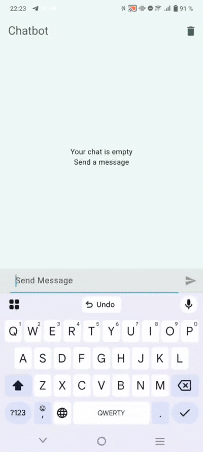

# Calm Gut
This is one of the simple projects for my client. 
It is about providing people with a simple app that helps them track their gut issues and get support from ChatBot with RAG. 

## About Structure
The backend is written on FastAPI. render.com has been used as a hosting service for the backend. 
The UI and some of the basic functionality is written of Flutter. 
### Flutter Libraries
I have used many libraries for different purposes. I have used BLoC for state management; GoRouter for nagivation management; html for writing data layer of the project; 

## Display of an App
| 
